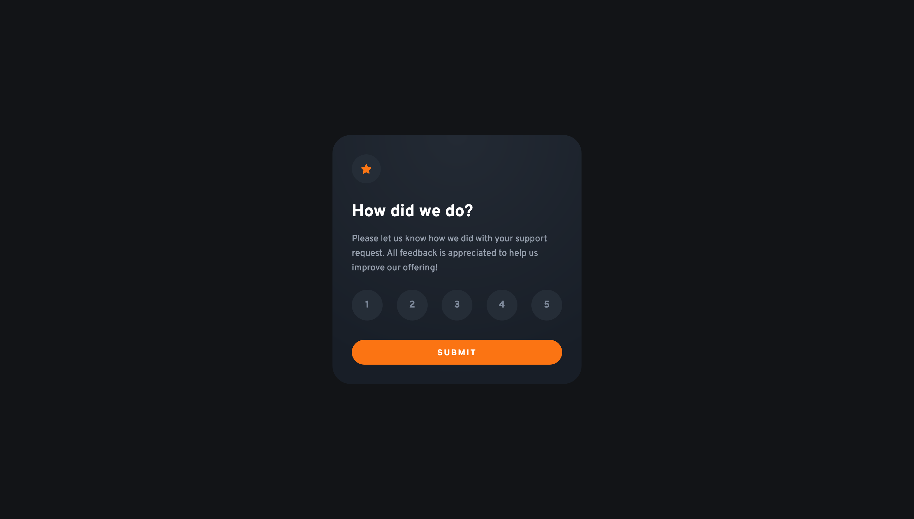

# Frontend Mentor - Interactive rating component solution

This is a solution to the [Interactive rating component challenge on Frontend Mentor](https://www.frontendmentor.io/challenges/interactive-rating-component-koxpeBUmI). Frontend Mentor challenges help you improve your coding skills by building realistic projects. 

## Table of contents

- [Overview](#overview)
  - [The challenge](#the-challenge)
  - [Screenshot](#screenshot)
  - [Links](#links)
- [My process](#my-process)
  - [Built with](#built-with)
  - [What I learned](#what-i-learned)
  - [Useful resources](#useful-resources)

## Overview

### The challenge

Users should be able to:

- View the optimal layout for the app depending on their device's screen size
- See hover states for all interactive elements on the page
- Select and submit a number rating
- See the "Thank you" card state after submitting a rating

### Screenshot

### Links

- Solution URL: [https://ruslanmsv.github.io/interactive-rating-component/](https://ruslanmsv.github.io/interactive-rating-component/)

## My process

### Built with

- CSS custom properties
- Flexbox
- CSS Grid
- Vanilla JS

### What I learned

1. How to make custom radio buttons with text;
2. How to center grid container content with `place-content: center;` CSS property;
3. How to get form data in `onsubmit` event handler with FormData API;

### Useful resources

- [Stack Overflow](https://stackoverflow.com/a/71610660) - This helped me to make custom radio buttons for rating values